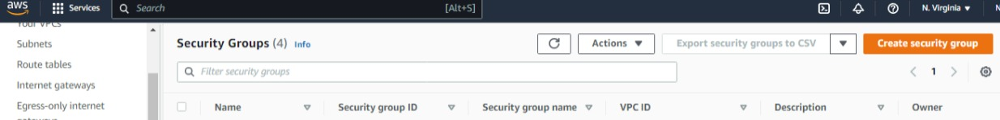
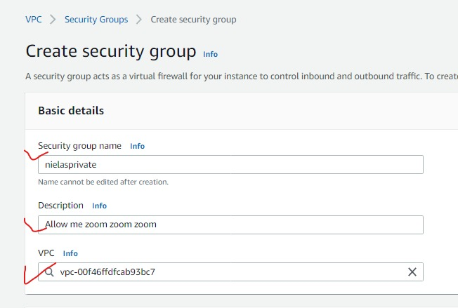
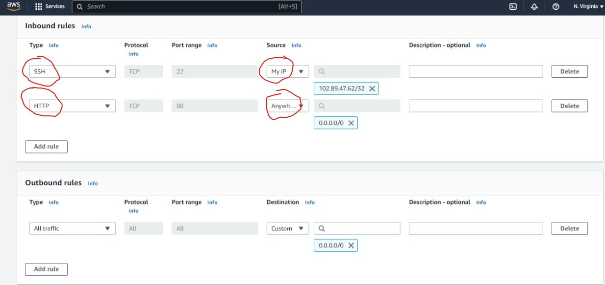
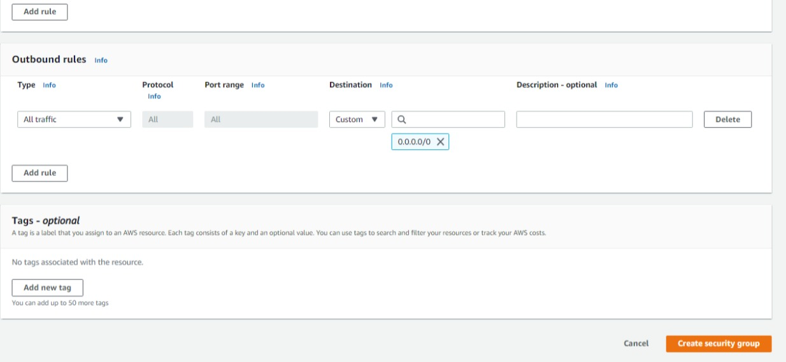

## This shows the steps to create the security group which would be used to enhance security. 
  
 
STEPS:

 Navigate to the AWS console and setup the Security group. 

<ul> <li> Click "create Security group" </li> </ul>

    

<ul> <li> Enter name of security group preferred </li>
     <li> Enter the description </li>
     <li> The VPC would auto populate of you have ove only one vpc, hypu would be able to choose which vpc you want to connect the security group to. Note, it must be connected to a VPC.  </li>
 </ul>

    

 Setup the rules for access. 

<ul> <li> The first type is SSH, since i am building a private instance, I am setting the source to my IP. Which means only my IP can access any instance connected to this security group. </li>
     <li> The second is HTTP and the source is anywhere IPv4</li>
     <li> Outbound rule is left as is.</li>
     </ul>

   

<ul> <li> Click create security grop</li>
     </ul>

   

 This would create the security group 
