## Creating the instance. 
  
 
STEPS:

 Navigate to the AWS console and select EC2. 

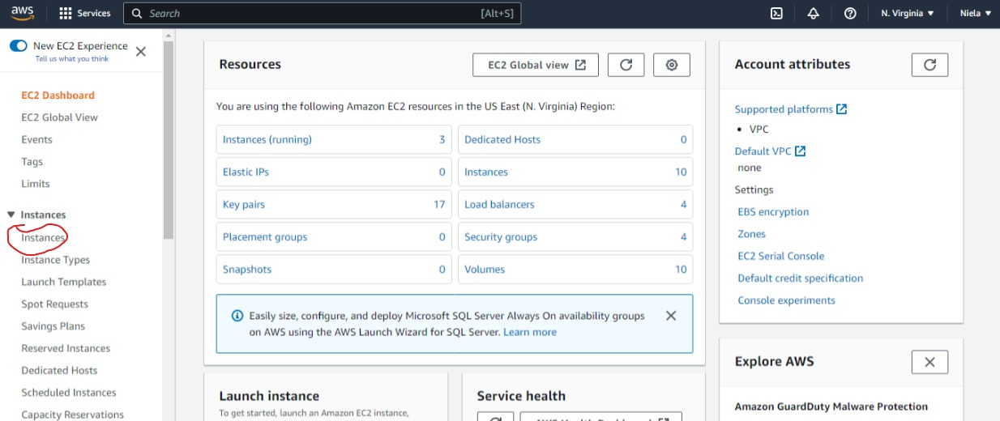
    

<ul> <li> Click "Launch Instance" </li> </ul>

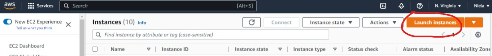
    

<ul> <li> Enter name of instance preferred </li>
 </ul>

 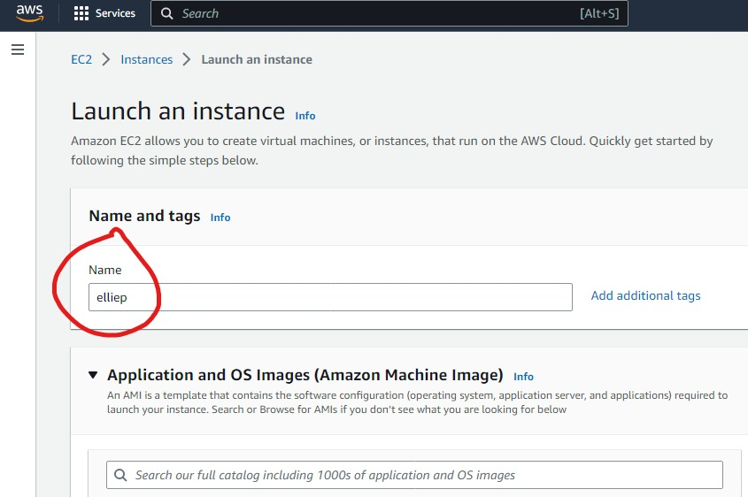
    

<ul> <li> Select Machine Language, in this case i chose AWS linux 2, the free tier.  </li>
 </ul>

 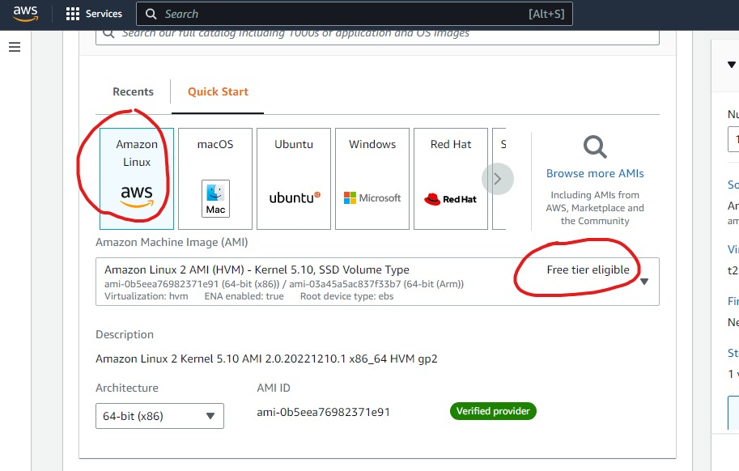
    

<ul> <li> Select the instance type.  </li>
<li> Chose the key pair to be used, if no key pair is availabe create one.  </li>
 </ul>

 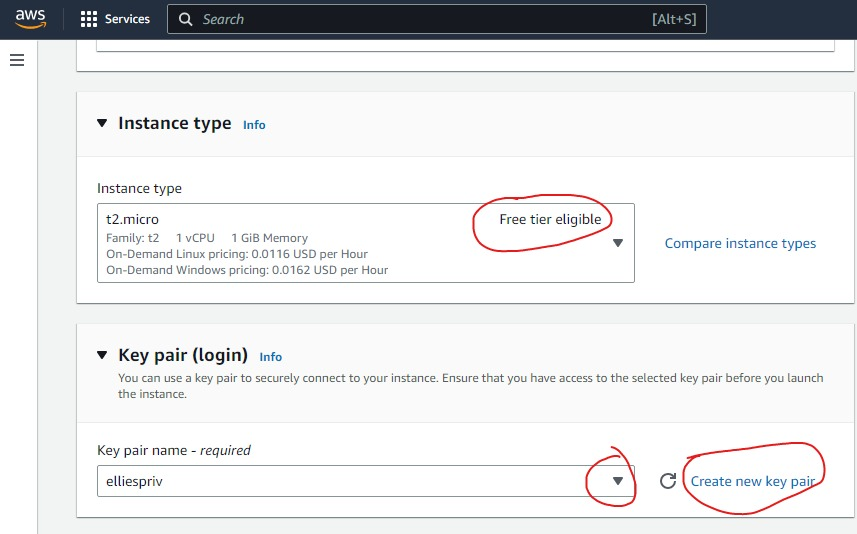
    

<ul> <li> Select the VPC created earlier. </li>
     <li> Select the private subnet for a private instance. </li>
     <li> Disable auto assign IP.  </li>
     <li> Select the security gropu created.  </li>
 </ul>

 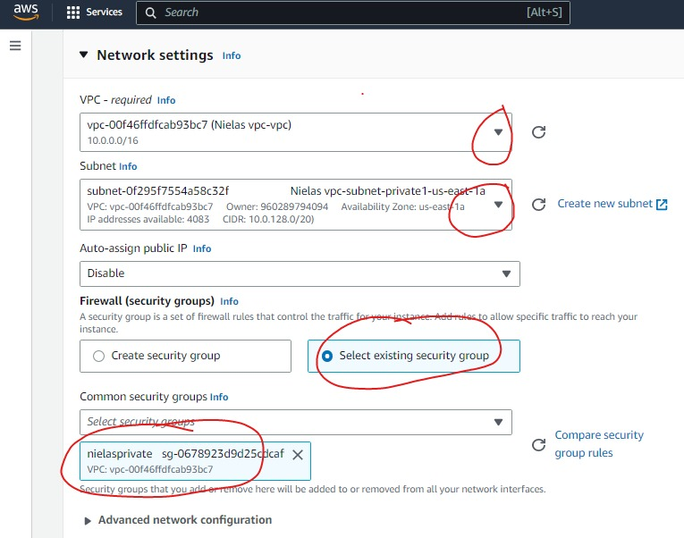
   

<ul> <li> Click on Advanced details. </li>
     </ul>

 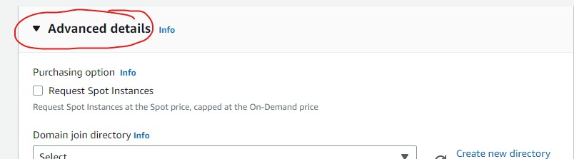
   

<ul> <li> Input the bash script to install NGINX and start the service in user data. </li>
      </ul>

 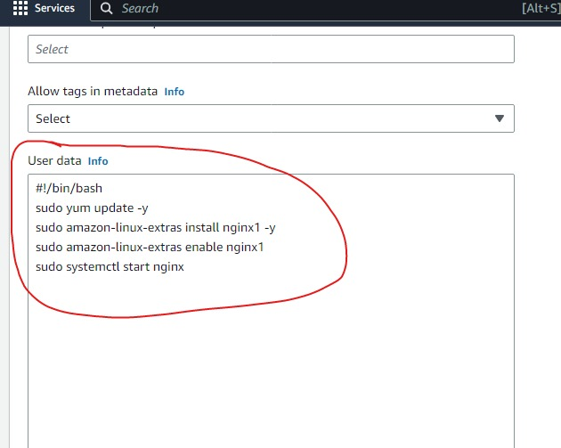
   

<ul> <li> Preview the summary. </li>
     <li> Increase the number of instances to 2.  </li>
     <li> Click on launch Instance.  </li>
 </ul>

 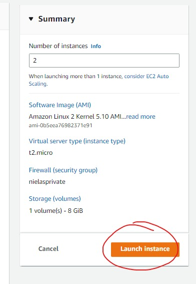
   

<ul> <li> Click on instances to see the instances created </li>
 </ul>

 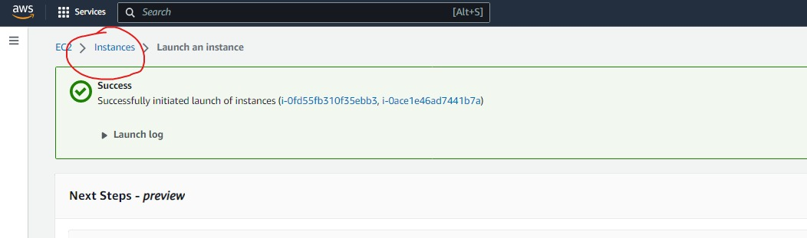
   

 Click on instances to see the instances created 

 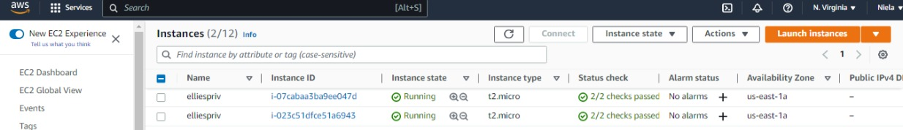
   

<ul> <li> Copy SSH key </li>
 </ul>

 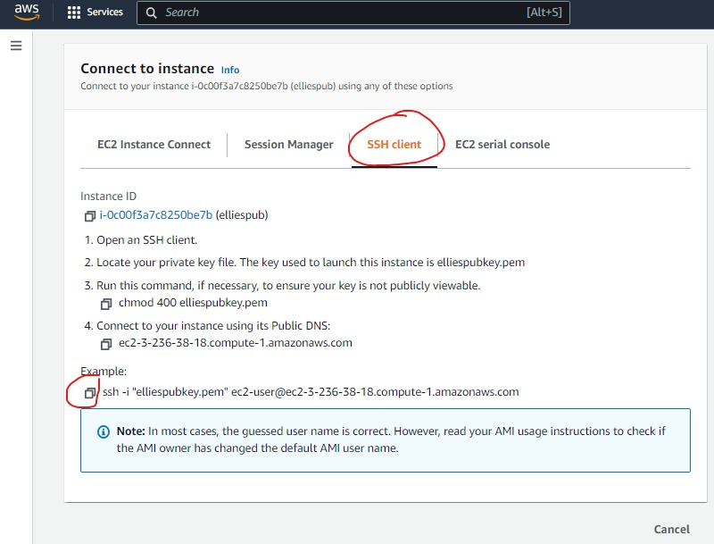
   

<ul> <li> Open terminal and paste ssh command in path where key pair is stored. First, sshing into public instance whoch is c=acting as Bastion host.  </li>
 </ul>

 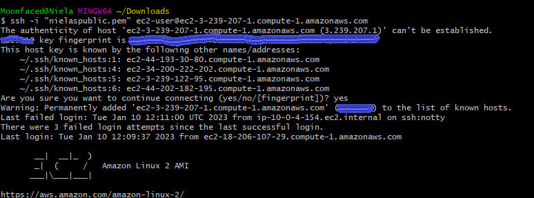
   

<ul> <li> Create a nano file and paste the content of the private key created. </li>
     <li> Give chmod 400 to created file </li>
 </ul>

 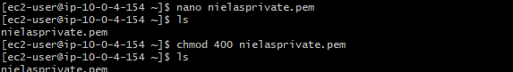
   

<ul> <li> SSH into first private server. </li>
 </ul>

 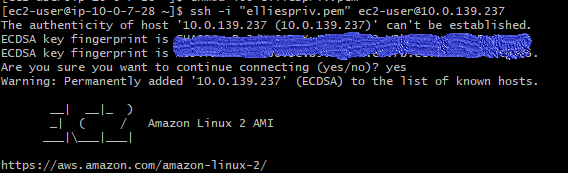
   

<ul> <li> Edit html file with server ip details. </li>
 </ul>

 
   

<ul> <li> Exit to public instance, gthen ssh into private server 2. </li>
 </ul>

 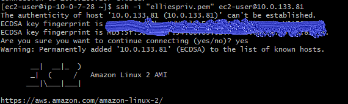
   

<ul> <li> Edit html file with server ip details. </li>
 </ul>

 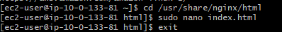
   

<ul> <li> Restart both services. </li>
 </ul>

 
   

<b>TO BE CONTINUED, when i come back, we will talk about creating target groups and a load balancer!!! </b>