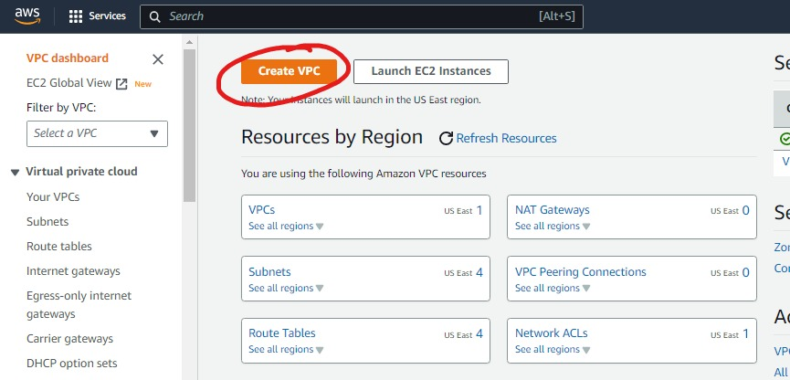
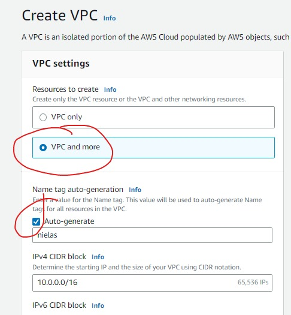
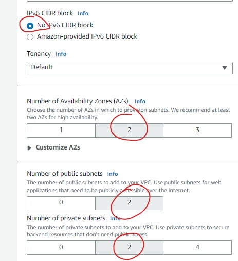
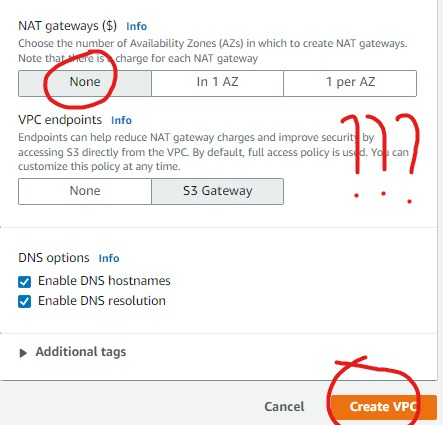
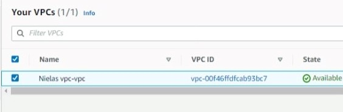

## This shows the steps to create the VPC in which my instanvce will be created. 
### The VPC is a private enviroment which enhances the security of the instance.  
  
 
STEPS:
    
 Navigate to the AWS console and setup the VPC 

<ul> <li> Click "create VPC" </li> </ul>

   

 The next step is to input the details required to setup 

<ul> <li> Select "VPC and more" </li>
     <li> Select the auto generate check box and input the name that would be used for the VPC" </li> 
</ul>

   

<ul> <li> Select "No IPv6 CIDR block" </li>
     <li> Select the number of availability zones wanted, select atlest 2 </li>
     <li> Select "the number of public subnets wangted" </li>
     <li> Select the number of private subnet wanted </li>
</ul>

   

<ul> <li> Select "None for NAT Gateway, this incurs cost, so nope would not be using it. " </li>
     <li> Select s3 endpoints as a substituteinstead in the eventuality that it may be needed. </li>
     <li> Click "create VPC" </li>
     </ul>
     
 This would create the VPC. 

   

 Here you can see list of vpc created. 

   

<b> I created a VPC with public and private private subnets, this would help me in sshing in creating instance either public or private. </b>

 Next step is to create the security group. 
